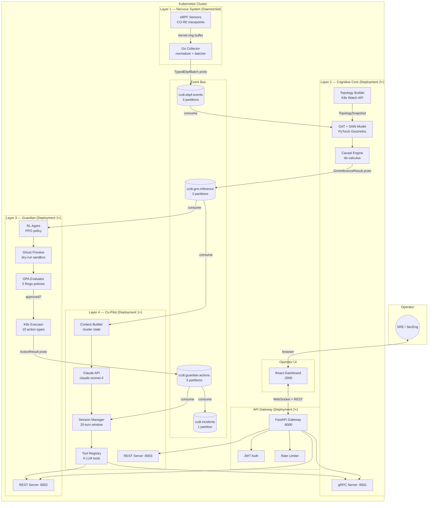

# CCDT System Overview

## What is CCDT?

CCDT (Cognitive Digital Twin) is a **Level-4 Autonomous AIOps Security Platform** that provides continuous, real-time observability and autonomous remediation for Kubernetes clusters. It uses four biologically-inspired layers to detect security threats and operational faults, simulate remediation actions, and execute them — all without human intervention for low-risk situations.

The system runs entirely within the cluster as a set of Kubernetes workloads and requires no external dependencies except the Anthropic Claude API for the Co-Pilot layer.

---

## Biological Analogy

The four layers mirror the mammalian nervous system:

| Biological System | CCDT Layer | Function |
|---|---|---|
| Peripheral Nervous System | Layer-1: Nervous System | Sense raw signals from the environment |
| Cerebral Cortex | Layer-2: Cognitive Core | Pattern recognition and causal reasoning |
| Motor Cortex + Cerebellum | Layer-3: Guardian | Decision making and action execution |
| Language Centre + Prefrontal Cortex | Layer-4: Co-Pilot | Communication with the human operator |

---

## Component Architecture



---

## Data Flow Summary

```
eBPF sensor
    │  (kernel ring buffer, per-CPU)
    ▼
Go Collector (normalizer, batcher, publisher)
    │  TypedEbpfBatch (proto3, ≤ 500 events, ≤ 64 KB)
    ▼
Kafka: ccdt.ebpf.events   (3 partitions, keyed by node_name)
    │
    ├─────────────────────────────────────┐
    ▼                                     ▼
Layer-2 GNN Consumer              (future: anomaly detector)
    │  TopologySnapshot (K8s Watch API)
    ▼
GAT Inference (4-layer GNN, 16-dim node features, 4-dim edge features)
    │  GnnInferenceResult (proto3, ~600 bytes)
    ▼
Kafka: ccdt.gnn.inference  (3 partitions, keyed by inference_id)
    │
    ├─────────────────────────────────────┐
    ▼                                     ▼
Layer-3 RL Consumer               Layer-4 Co-Pilot Consumer
    │  ActionRequest                      │  IncidentReport (auto-inject)
    ▼                                     ▼
Ghost Preview → OPA → K8s Exec    Claude API (streaming SSE)
    │  ActionResult                       │  ChatResponse
    ▼                                     ▼
Kafka: ccdt.guardian.actions       Kafka: ccdt.incidents (unified)
```

---

## Kubernetes Workload Summary

| Workload | Kind | Replicas | Namespace |
|---|---|---|---|
| `layer1-nervous-collector` | DaemonSet | 1 per node | `ccdt-system` |
| `layer2-cognitive` | Deployment | 2 | `ccdt-system` |
| `layer3-guardian` | Deployment | 1 | `ccdt-system` |
| `layer4-copilot` | Deployment | 1 | `ccdt-system` |
| `ccdt-api-gateway` | Deployment | 2 | `ccdt-system` |
| `ccdt-dashboard` | Deployment | 1 | `ccdt-system` |
| `opa` | Deployment (sidecar) | 1 | `ccdt-system` |
| `kafka` | StatefulSet | 3 | `ccdt-infra` |

---

## Resource Requirements

| Service | CPU Request | CPU Limit | Memory Request | Memory Limit |
|---|---|---|---|---|
| layer1-nervous | 100m | 500m | 128Mi | 256Mi |
| layer2-cognitive | 500m | 2000m | 512Mi | 2Gi |
| layer3-guardian | 250m | 1000m | 256Mi | 1Gi |
| layer4-copilot | 250m | 500m | 256Mi | 512Mi |
| api-gateway | 100m | 500m | 128Mi | 256Mi |
| Kafka (per broker) | 500m | 2000m | 2Gi | 4Gi |

---

## Autonomy Levels

CCDT supports three autonomy modes configured via `AUTONOMY_MODE` env variable on Layer-3:

| Mode | Behaviour | Use Case |
|---|---|---|
| `human-in-loop` | Every action requires explicit operator approval | Initial rollout, regulated environments |
| `supervised` (**default**) | Auto-execute VERY_LOW + LOW risk; page for MEDIUM+ | Production SRE teams |
| `full-auto` | Auto-execute all OPA-approved actions | High-trust, proven environments |

Risk thresholds (Ghost Preview score):

| Risk Category | Score Range | Default Action |
|---|---|---|
| VERY_LOW | 0.00 – 0.19 | Auto-execute in `supervised` + `full-auto` |
| LOW | 0.20 – 0.34 | Auto-execute in `supervised` + `full-auto` |
| MEDIUM | 0.35 – 0.59 | Page operator in `supervised`; auto in `full-auto` |
| HIGH | 0.60 – 0.74 | Always require human approval |
| VERY_HIGH | 0.75 – 1.00 | Always require human approval |

---

## Incident Lifecycle

```
 1. DETECTING      GNN confidence rising; not yet above 0.70 threshold
 2. ACTIVE         GNN confidence ≥ 0.70; incident declared
 3. REMEDIATING    Guardian has selected and is executing an action
 4. RESOLVED       Post-action health check passes; OOM rate drops to baseline
 5. FALSE_POSITIVE Operator marks incident as a false positive (feeds fine-tuning)
```

---

## SLA Targets

| Metric | Target |
|---|---|
| Time-to-detect (TTD) | < 30 seconds from first eBPF event |
| Time-to-classify (TTC) | < 5 seconds from event batch receipt |
| GNN inference latency (p99) | < 100ms |
| Guardian action selection (p99) | < 200ms |
| Ghost Preview simulation (p99) | < 500ms |
| Total time-to-remediate (TTR) | < 90 seconds end-to-end |
| Co-Pilot first token (p99) | < 3 seconds |
| Dashboard refresh rate | 5 seconds |
